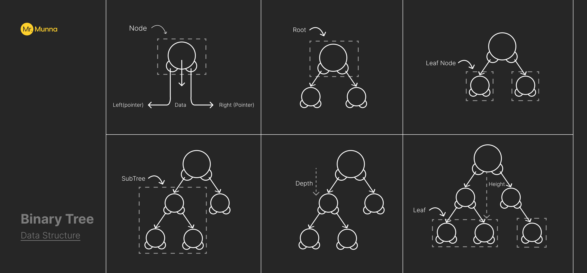
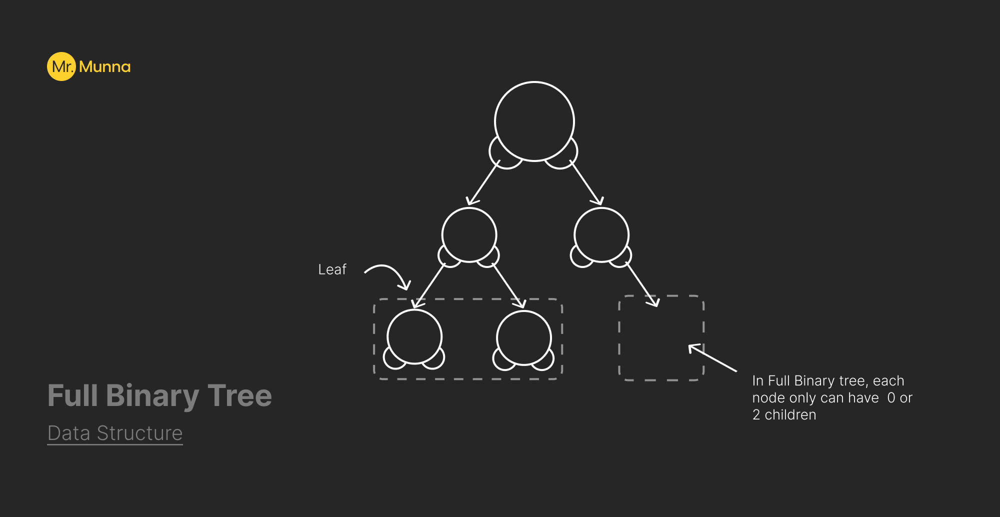
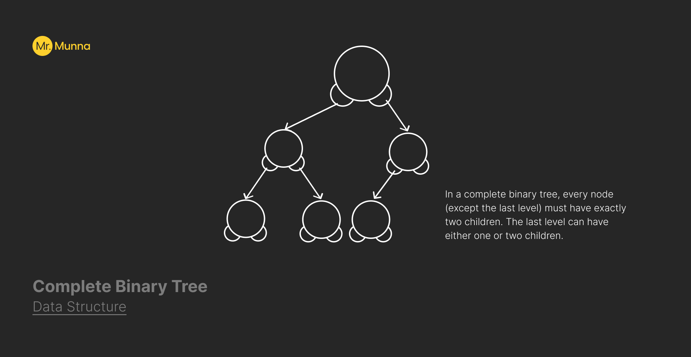
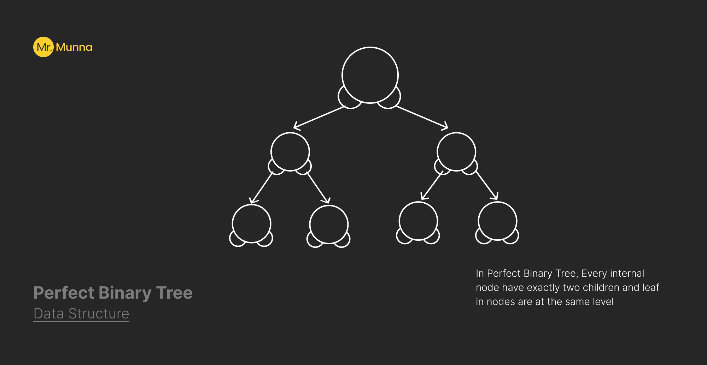
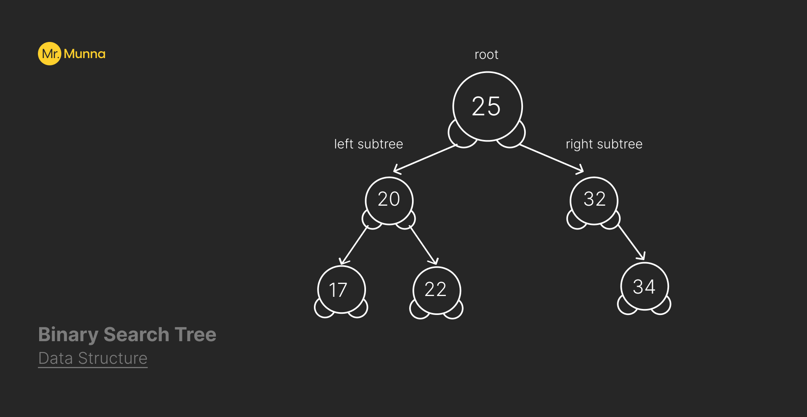

# Binary Tree Concept

&#10687; A binary tree is a tree data structure where each `node` consist at most `2 chilren` (left & right) and that has exactly 1 root.
&#10687; There is only 1 path between root and any node. Empty tree also considered as binary tree.

### Key Concepts

&#10687; **Node** &#8227; A basic unit of a binary tree that contains a value or data as well as pointers to its left and right descendants.

&#10687; **Root** &#8227; The tree's highest node, which is without parents.

&#10687; **Leaf** &#8227; A node with no childrens.

&#10687; **SubTree** &#8227; A tree made out of every child node on a node.

&#10687; **Height** &#8227; The maximum distance that a root can travel before reaching a leaf.

&#10687; **Depth** &#8227; The path length between a root and a node.

### Visualization of stack &#8227;



### Full Binary Tree

&#10687; In Full Binary tree, each node only can have 0 or
2 children



### Complete Binary Tree

&#10687; In a complete binary tree, every node (except the last level) must have exactly two children. The last level can have either one or two children.



### Perfect Binary Tree

&#10687; In Perfect Binary Tree, Every internal node have exactly two children and leaf in nodes are at the same level



## Binary Search Tree

&#10687; A binary search tree is also a binary tree where left sub keys are less than root key
&#10687; Right sub keys are greater than root key
&#10687; Left sub trees and rights sub tress are must be binary search tree.



### Applications of Binary Search Trees

&#10687; **Searching** &#8227; BSTs allow for efficient search operations.

&#10687; **Sorting** &#8227; In-order traversal of a BST provides a sorted sequence of elements.

&#10687; **Hierarchical Data Representation** &#8227; Hierarchical data structures, such as file systems and organizational hierarchies, are represented as binary trees.

&#10687; **Expression Trees** &#8227; Used in syntax tree parsing and expression representation in compilers.

## Implementation of Binary Search Tree in Javascript

```javascript
//basic binary search implementation

class node {
  constructor(key) {
    this.key = key;
    this.left = null;
    this.right = null;
  }
}

class binarySearchTree {
  constructor() {
    this.root = null;
  }
}
```

### Insertion Method in BST

```javascript
  //insert a node in BST
  insertion(key) {
    const newNode = new BSTNode(key);
    if (!this.root) {
      return (this.root = newNode);
    } else {
      this.insertNode(this.root, newNode);
    }
  }
  //insertNode function (recursive)

  insertNode(node, newNode) {
    // node -> root
    if (newNode.key < node.key) {
      if (node.left === null) {
        node.left = newNode;
      } else {
        this.insertNode(node.left, newNode);
      }
    } else {
      if (node.right === null) {
        node.right = newNode;
      } else {
        this.insertNode(node.right, newNode);
      }
    }
  }

//recursive method
const recursiveDepthFirstTraversal = (root) => {
  if (root === null) {
    return [];
  }

  const leftValues = recursiveDepthFirstTraversal(root.left);
  const rightValues = recursiveDepthFirstTraversal(root.right);

  return [root.key, ...leftValues, ...rightValues];
};


// just inserting random keys
const bst = new binarySearchTree();

bst.insertion(15);
bst.insertion(25);
bst.insertion(10);
bst.insertion(7);
bst.insertion(22);
bst.insertion(17);
bst.insertion(13);


```

### Deletion in BST

```Javascript
  //delete key from a bst
  delete(key) {
    if (this.root === null) {
      return null;
    } else {
      this.root = this.deleteNode(this.root, key);
    }
  }

  //deletenode Function
  deleteNode(node, key) {
    if (key < node.key) {
      node.left = this.deleteNode(node.left, key);
    } else if (key > node.key) {
      node.right = this.deleteNode(node.right, key);
    } else {
      if (node.left === null && node.right === null) {
        return null;
      } else if (node.left === null) {
        return node.right;
      } else if (node.right === null) {
        return node.left;
      } else {
        let tempNode = this.findMinNode(node.right);
        node.key = tempNode.key;
        node.right = this.deleteNode(node.right, tempNode.key);
      }
    }
    return node;
  }

  //finding the smallest value of right subtree
  findMinNode(node) {
    while (node.left) {
      node = node.left;
    }
    return node;
  }

```

### Breadth first Search of BST

```javascript
const breadthFirstSearch = (root) => {
  const values = [];
  if (root === null) {
    return values;
  }

  const queue = [root];
  while (queue.length > 0) {
    const node = queue.shift(); // point of optimization
    values.push(node.key);

    if (node.left !== null) {
      queue.push(node.left);
    }

    if (node.right !== null) {
      queue.push(node.right);
    }
  }

  return values;
};

const recursiveBFS = (root) => {
  if (root === null) return [];
  const leftValues = recursiveBFS(node.left);
  console.log(leftValues);
  const rightValue = recursiveBFS(node.right);
  console.log(rightValue);

  return [root, node.right, node.left];
};
```

### Depth First Search of BST

```javascript
//normal approach (stack)
const depthFirstTraversal = (root) => {
  const values = [];
  if (root === null) {
    return values; // or [];
  }

  const stack = [root];

  while (stack.length > 0) {
    const node = stack.pop();
    values.push(node.key);

    if (node.right !== null) {
      stack.push(node.right);
    }

    if (node.left !== null) {
      stack.push(node.left);
    }
  }
  return values;
};

//recursive approach

const recursiveDepthFirstTraversal = (root) => {
  if (root === null) {
    return []; //return empty array or any message
  }
  const leftValues = recursiveDepthFirstTraversal(root.left);
  console.log(`left values ->` + leftValues);
  const rightValues = recursiveDepthFirstTraversal(root.right);
  console.log(`right values :` + rightValues);

  return [root.key, ...leftValues, ...rightValues];
  //this will return [  1, [ 2, [4, undefined, undefined],  [5, undefined, undefined] ], [ 3, undefined, [6, undefined, undefined]]] [a, [b,d,e], [c,f,g]];

  //if we want to store in them in one array then: then
  // -> return [this.root,...leftValues, ...rightValues]
};
```

### Inorder Traversal, PreOrder Traversal, PostOrder Traversal of BST

```javascript
 //pre order traversal
  preOderTraversal() {
    const result = [];
    this.preOrder(this.root, result);
    return result;
  }

  preOrder(node, result) {
    if (node !== null) {
      result.push(node.key);
      this.preOrder(node.left, result);
      this.preOrder(node.right, result);
    }
  }

  //in order traversal
  inOrderTraversal() {
    const result = [];
    this.inOrder(this.root, result);
    return result;
  }

  inOrder(node, result) {
    this.inOrder(node.left, result);
    result.push(node.key);
    this.inOrder(node.right, result);
  }

  //post order traversal
  postOrderTraversal() {
    const result = [];
    this.postOrder(this.root, result);
    return result;
  }

  postOrder(node, result) {
    this.postOrder(node.left, result);
    this.postOrder(node.right, result);
    result.push(node.key);
  }
```

## Author

#### Mr. Munna
