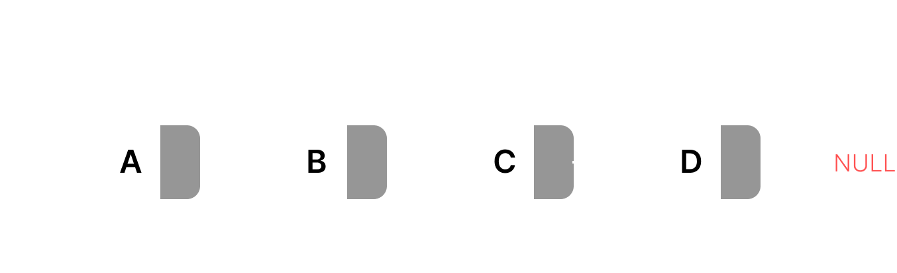

# Linked List Concept

A linked list is a linear dynamic data structure which consist of a node where each nodes contains data and a reference to the next node in sequence. The elements are not stored at contiguous memory locations. The elements in a linked list are linked using pointers.

This allows for dynamic memory allocation and efficient insertion and deletion operations compared to arrays.

### Linked List Applications

&#10687; Efficient Memory Utilization ,i.e no need to pre-allocate memory

&#10687; Implementing stacks and queues using linked lists.

&#10687; Using linked lists to handle collisions in hash tables.

&#10687; Representing graphs using linked lists.

&#10687; Allocating and deallocating memory dynamically.

### Visualization of Singly Linked List Linked List &#8227;



### Implementation of Singly Linked List in Javascript

```javascript
class Node {
  constructor(data, next = null) {
    this.data = data;
    this.next = next;
  }
}

class LinkedList {
  constructor() {
    this.head = null;
  }

  // Insert data at the start
  insertAtFirst(data) {
    const newNode = new Node(data, this.head);
    this.head = newNode;
  }

  // Insert data at a given node
  insertDataAtGivenValue(prevNode, data) {
    if (!prevNode) return "prevNode cannot be null";
    const newNode = new Node(data, prevNode.next);
    prevNode.next = newNode;
  }

  // Insert data at the end
  insertAtLast(data) {
    const newNode = new Node(data);
    if (!this.head) {
      this.head = newNode;
      return;
    }
    if (!this.head.next) {
      this.head.next = newNode;
      return;
    }
    let lastNode = this.head.next;
    while (lastNode.next) {
      lastNode = lastNode.next;
    }
    lastNode.next = newNode;
  }

  // Size of the linked list
  size() {
    let count = 0;
    let currentNode = this.head;
    while (currentNode) {
      count++;
      currentNode = currentNode.next;
    }
    console.log(count);
    return count;
  }

  // Get the first element of the list
  getFirst() {
    return this.head.data;
  }

  //clear the list
  clear() {
    return (this.head = null);
  }

  // Remove the first element
  removeFirst() {
    return (this.head = this.head.next);
  }

  // Remove element by given key
  removeByGivenKey(key) {
    if (!this.head) {
      return "Linked List is Empty";
    }
    if (this.head.data === key) {
      this.head = this.head.next;
    }
    let prevNode = this.head;
    let currentNode = this.head.next;

    while (currentNode) {
      if (currentNode.data === key) {
        currentNode = currentNode.next;
        return;
      }
      prevNode = currentNode;
    }

    return "No node is found with the key";
  }

  // Remove last element
  removeLast() {
    if (!this.head) {
      return "LinkedList is empty";
    }
    if (!this.head.next) {
      this.head = null;
      return;
    }

    let currentNode = this.head.next;

    while (currentNode.next) {
      currentNode = currentNode.next;
    }

    currentNode = null;
  }

  // Search operation in linked list (LeetCode)
  //search node with a given index
  getAt(index) {
    let current = 0;
    let node = this.head;

    while (node) {
      if (current === index) {
        return node;
      }
      node = node.next;
      count++;
    }
    return null;
  }

  //search node with key
  getWith(key) {
    if (!this.head) return "Linked List is empty";
    let currentNode = this.head;

    while (currentNode.next) {
      if (currentNode.key === key) {
        return true;
      }
      currentNode = currentNode.next;
    }
    return false;
  }

  // Traversal of linked list (LeetCode)
  print() {
    if (!this.head) return "Linked List is empty";
    let listValues = [];
    let currentNode = this.head;
    while (currentNode.next) {
      listValues.push(currentNode);
      currentNode = currentNode.next;
    }

    return listValues.join(" -> ");
  }

  // Reverse linked list
  reverse() {
    let next = null;
    let prev = null;
    let current = this.head;

    while (current) {
      next = current.next;
      current.next = prev;
      prev = current;
      current = next;
    }
    this.head = prev;
  }
  //print linked list
  printList() {
    let arr = [];
    let node = this.head;
    while (node) {
      arr.push(node.data);
      node = node.next;
    }
    console.log(arr.join(" -> "));
    return arr;
  }
}

// Example usage:
const ll = new LinkedList();
ll.insertAtFirst(3);
ll.insertAtFirst(2);
ll.insertAtFirst(1);
// ll.insertDataAtGivenValue();
ll.printList(); // Output: 1 -> 2 -> 3
ll.size();
// ll.reverse();
// ll.printList(); // Output: 3 -> 2 -> 1
```

## Author

#### Mr. Munna
