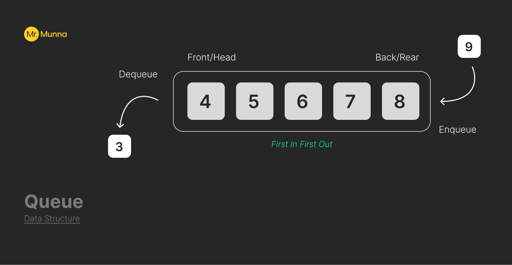

# Queue Concept

A queue is a special type data structure is used for storing and managing data in a specific order. It follows the principal of **FIFO** where the first element added to the queue is the first one to be removed.

To remember queue in other way we can compare queue with McDonalds queue system.

### Usage Of Queue:

&#10687; Task scheduling in operating systems

&#10687; Simulation of real-world systems (e.g., waiting lines)

&#10687; Priority queues for event processing

### Visualization of Queue &#8227;



### Implementation in Javascript

```javascript
class Queue {
  constructor(c) {
    this.front = 0;
    this.rear = 0;
    this.capacity = c;
    this.queue = new Array(this.capacity);
  }

  // To insert an element at the rear of the queue
  enqueue(data) {
    // Check queue is full or not
    if (this.capacity === this.rear) {
      return "Queue is empty";
    }
    // insert element at the rear
    else {
      this.queue[this.rear] = data;
      this.rear++;
    }
    return;
  }

  //removing the first element that has been added in the queue and resetting the queue
  dequeue() {
    if (this.isEmpty()) {
      return "Queue is empty";
    } else {
      for (let i = 0; i < this.rear - 1; i++) {
        this.queue[i] = this.queue[i + 1];
      }
      if (this.rear < this.capacity) this.queue[this.rear] = 0;
      this.rear--;
    }

    return;
  }

  //checks if the queue is empty or not
  isEmpty() {
    return this.front === this.rear ? true : false;
  }

  //print front of the queue
  peek() {
    if (this.isEmpty()) {
      return "Queue is empty";
    }
    return this.queue[this.front];
  }

  //total size of the queue
  size() {
    return this.queue.length;
  }

  //remove all the values
  clear() {
    this.queue = [];
  }

  //print all the value
  printQueue() {
    if (this.isEmpty()) {
      return "Queue is empty";
    }
    let str = "";
    for (let i = this.front; i < this.rear; i++) {
      str += this.queue[i] + "\n";
    }
    return str;
  }

  //convert to array
  toArray() {
    const newQueue = new Queue();
    newQueue.queue = [...this.queue];
    return newQueue;
  }

  //convert to string
  toString() {
    return this.queue.join(", ");
  }
}

let queue = new Queue(4);

queue.enqueue(20);
queue.enqueue(30);
queue.enqueue(40);
queue.enqueue(50);
queue.dequeue();
console.log("front value:", queue.peek());
console.log(`queue value:`, queue.printQueue());
```

## Author

#### Mr. Munna
