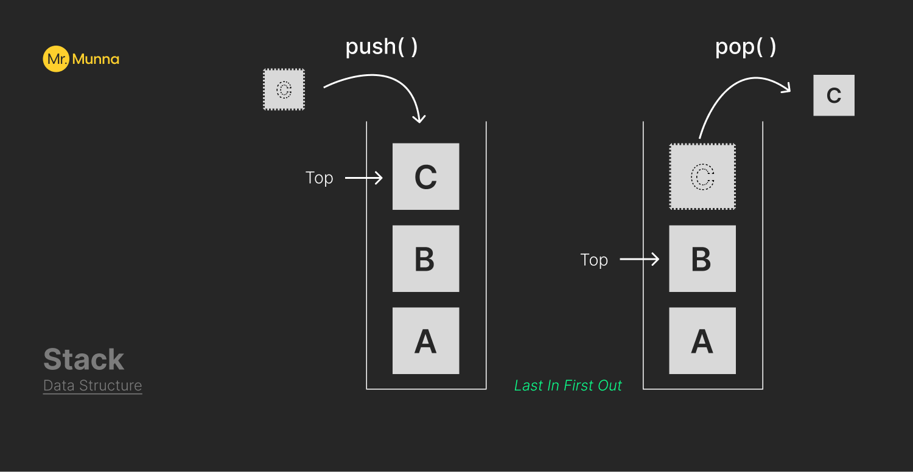

# Stack Class Implementation in JavaScript

Stacks are a data structure that store information in a form of a list. They allow only adding & removing elements under a **_LIFO_** pattern.

Stacks are useful when we need to make sure elements follow the **_LIFO_** method.

## Usage Of Stacks:

&#10687; Javascript's Call Stack.

&#10687; Managing function invocation in various programming languages.

&#10687; The undo/redo functionality many programs offers.

### Visualization of stack &#8227;



```javascript
class Stack {
  constructor() {
    this.stack = [];
  }

  // this method will add the value at the last
  push(data) {
    this.stack.push(data);
  }

  // this method will remove the value from first
  pop() {
    this.stack.pop();
  }

  // this method will give the last element of the stack
  peek() {
    return this.stack[this.stack.length - 1];
  }

  // this method gives whether the stack is empty or not
  isEmpty() {
    return this.stack.length === 0 ? true : false;
  }

  // this method gives the size of the stack
  size() {
    return this.stack.length;
  }

  // this method clear all the elements from stack
  clear() {
    this.stack = [];
  }

  // this method will check whether some element is present or not
  contain(elem) {
    return this.stack.includes(elem);
  }

  // this method reverse the stack
  reverse() {
    return this.stack.reverse();
  }

  // this method print the values of stack
  printStack() {
    let string = "";
    for (let i = 0; i < this.stack.length; i++) {
      string += this.stack[i] + "\n";
    }
    return string;
  }

  // this method will make a copy of old stack
  clone() {
    let newStack = new Stack();
    newStack.stack = [...this.stack];
    return newStack;
  }

  // this method will return the stack into an array
  toArray() {
    return [...this.stack];
  }

  // this method returns stack into string
  toString1() {
    return this.stack.join(", ");
  }

  // another way of printing stack into string
  toString2() {
    return this.stack.toString();
  }
}

// Usage of Stack
let myStack = new Stack();

// push
myStack.push(5);
myStack.push(9);
myStack.push(7);
myStack.push(2);
myStack.push(6);
myStack.push(0);
myStack.push(4);
myStack.push(5);

console.log(myStack.printStack());

// pop
myStack.pop();

console.log(myStack.printStack());

const clonedStack = myStack.clone();
console.log(clonedStack.printStack());

console.log(myStack.toArray());

console.log(myStack.toString1());

console.log(myStack.toString2());

console.log(myStack.reverse());

console.log(myStack.size());

console.log(myStack.clear());

console.log(myStack.isEmpty());

console.log(myStack.size());
```

## Author

#### Mahfuzur Rahman Munna
